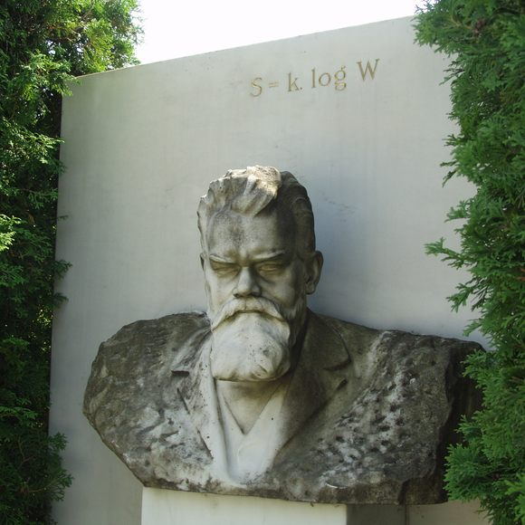
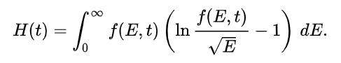
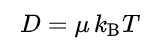
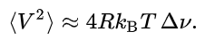
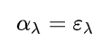
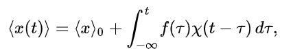
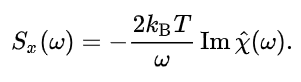
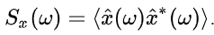
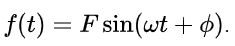
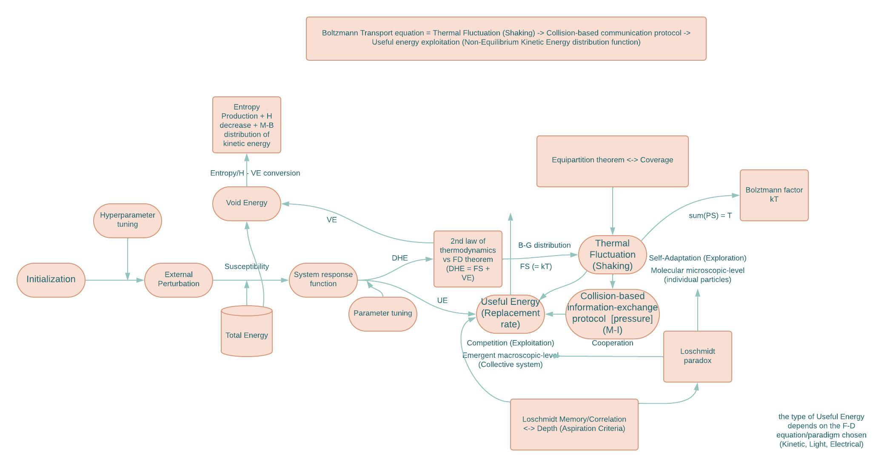

# Fluctuation-Dissipation-Algorithm
Introducing the Fluctuation-Dissipation algorithm! An optimization algorithm inspired from statistical physics notions such as the Boltzmann-Gibbs distribution as well as H-theorem, and more precisely Fluctuation-Dissipation theorem. This project is a tribute to the genius of Ludwig Boltzmann:

About a bipolar man with nonetheless a thorough empirical and mathematical scrutiny and attention to details, a visionary from beyond this world, who revolutionized physics in the most unprecdented of manners: Ludwig Boltzmann, the genius of disorder.\
\

Boltzmann's brilliance unveils the poetic dance of particles, weaving a symphony of elegance through statistical beauty.
This project could be summed up poetically by a beautiful quote from none other than the statistical physics legend himself:
"the life contest is primarily a competition for available energy" - Ludwig Boltzmann 
## Kinetic Molecular theory (J.C. Maxwell, 1867)
The kinetic molecular theory is a fundamental concept in physics and chemistry that explains the behavior of gases at the molecular level. It provides a framework for understanding the properties and characteristics of gases based on the motion and interactions of individual gas particles.

The kinetic molecular theory makes five key assumptions:

1. Gas particles are in constant motion: Gas particles are in continuous random motion, moving in straight lines until they collide with other particles or with the walls of the container (Molecular Chaos hypothesis "Stosszahlansatz", which was challenged by J. Loschmidt)
2. Negligible volume: The volume occupied by the gas particles themselves is negligible compared to the volume of the container. The gas particles are considered point masses.
3. Negligible intermolecular forces: Gas particles only interact through elastic collisions, and the attractive and repulsive forces between them are negligible except during collisions (this will be later updatewd by Van der Vaals)
4. Conservation of energy: The total kinetic energy of the gas particles remains constant, provided there is no net transfer of energy between the gas and its surroundings. Temperature is defined as the average kinetic energy of particles via the following equation: 3/2kT = avg(KE) (Equipartition theorem)
5. Random and elastic collisions: Collisions between gas particles and with the walls of the container are perfectly elastic, meaning there is no loss of kinetic energy during collisions. The total momentum of the system is conserved. From this notion of collsions, pressure is defined as the frequency of inter-particles collisions as well as bouncing off the wall (this will be exploited algorithmically via Loschmidt memory/correlation via mutual information-enabled information exchange cooperation)

Based on these assumptions, the ideal-gas state equation (also known as the ideal gas law) can be derived. The ideal-gas state equation relates the pressure (P), volume (V), temperature (T), and number of moles (n) of gas. It is given by:

PV = nRT

where:

P represents the pressure of the gas.
V denotes the volume of the gas.
n is the number of moles of gas.
R is the ideal gas constant (a proportionality constant).
T represents the absolute temperature of the gas in Kelvin.
The ideal-gas state equation describes the relationship between the macroscopic properties (pressure, volume, and temperature) and the microscopic behavior (number of moles and kinetic energy) of an ideal gas. It allows for the calculation and prediction of gas properties under different conditions and is widely used in various fields of science and engineering. There are several gas laws that follow from the ideal-gas law (Boyle law, Gay-Lussac law, Charles law, Avogadro law and Dalton law)
## Equal a priori probabilities assumption (Statistical Mechanics):
 Statistical mechanics assumes that all microstates within a given macrostate are equally probable. This principle, known as the equal a priori probabilities principle, states that when there is no additional information available, all microstates compatible with a macrostate are equally likely. This assumption allows for the calculation of probabilities and the determination of thermodynamic quantities such as entropy, free energy, and temperature. There are few arguments that support this assumption:
1. Ergodic hypothesis: The ergodic hypothesis is an assumption in statistical mechanics that states that, over long periods of time, a system explores all of its accessible microstates with equal probability. This hypothesis allows for the assumption of equal a priori probabilities because it implies that a system in equilibrium will eventually visit all possible microstates compatible with the macroscopic constraints. In essence, it suggests that the system will spend a significant amount of time in each accessible microstate, leading to equal probabilities for each microstate within a given macrostate. The ergodic hypothesis simplifies the analysis by allowing the calculation of ensemble averages instead of time averages. (post-processing of solution accuracy, depth and coverage)
2. Maximum Entropy principle: The Maximum Entropy principle, also known as the principle of maximum entropy or the principle of indifference, is a principle used in statistical inference. It states that, given a set of constraints or information about a system, the probability distribution that should be chosen is the one that maximizes the entropy, subject to the given constraints. In the context of statistical mechanics, the Maximum Entropy principle is used to determine the equilibrium probability distribution of a system when limited information is available. It provides a way to assign probabilities to different microstates by maximizing the entropy under the given constraints, leading to the equal a priori probabilities assumption (depth and coverage post-processing)
3. Principle of Indifference: The Principle of Indifference, also known as the Principle of Insufficient Reason, is a principle used to assign probabilities in situations of complete ignorance or lack of information. It suggests that when there is no reason to favor one outcome over another, all possible outcomes should be assigned equal probabilities. In the context of statistical mechanics, the Principle of Indifference supports the assumption of equal a priori probabilities because, in the absence of any specific knowledge about the system, it treats all microstates within a given macrostate as equally likely. It provides a method for assigning probabilities to microstates when there is no specific information available to differentiate them. (post-processing Depth, Coverage)
## H-Theorem, Boltzmann's entropy formula, Maxwell-Boltzmann Distribution and Boltzmann Transport equation (Loschmidt's paradox)
H-theorem is an attempt by L. Boltzmann to derive the second law of thermodynamics from statistical mechanics by proving that a statistical approach via averaging out details about each particle (atom or molecule) in the form of probability distribution (statistical ensembles) is nonetheless still able to derive irreversibility of thermodynamic processes. In the attempt to do so, H-theorem hypothesizes 3 fundamental axioms:
1. Microscopic reversibility: This is problematic due to Loschmidt's paradox that prevents deriving irreversible process such as 2nd law of thermodynamics from microscopically reversible processes. This paradox has been resolved in 1895 by tweaking the molecular chaos hypothesis in that the paricles velocities, positions and therefore kinetic energies tend to correlate after collisions.  Such correlations are encoded in Boltzmann's entropy formula S = K logW (Boltzmann, 1877) which was motivated by his debate with J. Loschmidt. To be more precise, reversibility is not an emergent phenomenon (from microscopic reversibility we get macroscopic irreversbility) due to the fact that molecular chaos hypothesis collapses in the macroscale due to the fact that, as the thermodynamic system evolves, positions, velocities and kinetic energies between molecules prior to collision start to become more and more correlated as the system starts having a sort of self-tracking, a sort of  "memory" of itself that helps distinguish between processes by analyzing series of past collisions encoded in correlations, and thus irreversibility emerges exactly because of such correlations that break Time-Reversal symmetry. That said, it is important to note that macroscopic reversibility is not strictly impossible (it is not forbidden by nature nor by logic or mathematical equations), it is just statistically unlikely to occur as that would decerease net entropy (in other words, macroscopic reversibility is not impossible but only computationally infeasible) thus the statistical definition of entropy: 1-probability of macroscopic reversal.
2. Low initial entropy (high initial H value): This assumption leads to the Past Hypothesis.
3. Molecular Chaos hypothesis (Stosszahlansatz) (James Clerk Maxwell, 1867): Independently chosen kinetic energies from the Maxwell-Boltzmann distribution, independent velocities directions, independent starting points during collisions between particles (uncorrelated collisions). This allows BBGKY hierarchy to reduce to Boltzmann's equation (a non-equilibrium equation describing changes in thermodynamic variables) in the sense where it is possible to compute energy distribution after collisions, more precisely via decoupling 2-particles distribution functions to a product (independence) of 1-particle distribution functions. H-theorem is a consequence of Boltzmann's transport equation supplied by Molecular Chaos hypothesis.
H value is determined by the energy distribution function f(E,t)dE which represents the number or fraction of molecules (occupation probability) having kinetic energy between E and E + dE. H value is precisely: 

Therefore, for each occupation probability distribution with respect to kinetic energy or speed, there is a H value that represents that overall distribution.
One such consequence of the H-theorem is the famous Maxwell-Bolztmann distribtuion describing the number or fraction of molecules (occupation probability) with a given speed (average speed or most occuring speed) in thermal equilibrium. Maxwell-Bolztmann distribution is a natural outcome in thermodynamic equilibrium that is reached when H is minimum.\
At the heart of all this lies the marvelous masterpiece of Ludwig Boltzmann; the Boltzmann Transport equation. the BT equation is a fundamental equation in statistical physics that describes the behavior of particles (such as atoms, molecules, or electrons) in a gas or plasma in non-equilibrium where thehrmodynamic variables are changing . It provides a framework for understanding how particles move, collide, and exchange energy in a system. It describes the time-evolution of statistical distribution of particles in phase space (position-momentum manifold) via the distribution funcion (probability density or occupation probability of finding particles with a specific position, momenmtum, speed or kinetic energy). The Boltzmann Transport equation builds upon Maxwell's kinetic theory by providing a more rigorous and quantitative description of the motion, interactions, and statistical distribution of particles. Maxwell-Boltzmann distribution is a steady-state solution of the Boltzmann equation in thermodynamic equilibrium where the kinetic energy distribution function is time-independent in the phase space. The Boltzmann equation is given by:

∂f/∂t + v ∙ ∇f + F ∙ ∇vf = C[f]

where:

∂f/∂t represents the partial derivative of the distribution function f with respect to time.\
v is the velocity vector of particles.\
∇ is the gradient operator in position space.\
∇v is the gradient operator in momentum space.\
F represents the external force acting on particles.\
C[f] is the collision term, accounting for the interactions and collisions between particles.

## Boltzmann-Gibbs Distribution (Boltzmann factor)
The Boltzmann distribution is derived from statistical mechanics and relies on the concept of entropy. According to the Boltzmann distribution, the probability P(E) of finding a system in a specific energy state E is proportional to the exponential of the negative ratio of the energy E to the product of the Boltzmann constant (k) and the temperature (T):

P(E) = (1/Z) * exp(-E / (k * T))

In this equation, Z represents the partition function, which acts as a normalization constant to ensure that the probabilities sum up to 1 over all possible energy states.

The Boltzmann distribution shows that lower energy states have higher probabilities of being occupied than higher energy states. As the temperature increases, the distribution becomes more spread out, allowing higher energy states to have a higher probability of being occupied.
The Boltzmann distribution (Gibbs distribution) is a manifestation of the principle of least effort that shows up again and again in say, analytical mechanics via the principle of least/stationary action (Euler-Lagrange equation or Hamilton principle).
## Information theory (relevant concepts to the algorithm):

1- Shannon Entropy: Shannon entropy, named after Claude Shannon, is a measure of the uncertainty or average amount of information in a random variable. It quantifies the amount of information or "surprise" associated with each possible outcome of a random variable. Mathematically, Shannon entropy of a discrete random variable X is defined as:
H(X) = -Σ P(x) * log2(P(x))
where P(x) represents the probability of each outcome x of the random variable X. Shannon entropy is always non-negative and reaches its minimum of 0 when the random variable has a single certain outcome.\
2- Conditional Entropy: Conditional entropy measures the average amount of information needed to describe a random variable Y given that another random variable X is known. It captures the remaining uncertainty about Y when X is given. Mathematically, the conditional entropy of Y given X is defined as:

H(Y|X) = -Σ Σ P(x, y) * log2(P(y|x))

where P(x, y) represents the joint probability distribution of X and Y, and P(y|x) represents the conditional probability of Y given X. Conditional entropy is always non-negative and reaches its minimum when Y is completely determined by X.\
3- Joint entropy is a measure in information theory that quantifies the uncertainty or average amount of information contained in a joint probability distribution of multiple random variables. It captures the overall uncertainty associated with the combined set of variables.

Mathematically, the joint entropy of a set of random variables X1, X2, ..., Xn is denoted as H(X1, X2, ..., Xn) and is defined as:

H(X1, X2, ..., Xn) = -Σ Σ ... Σ P(x1, x2, ..., xn) * log2(P(x1, x2, ..., xn))

Here, P(x1, x2, ..., xn) represents the joint probability distribution of the variables X1, X2, ..., Xn, and the double summation extends over all possible combinations of values for each variable.

Joint entropy measures the amount of uncertainty or average information needed to describe the combined set of variables. It takes into account the dependencies and correlations between the variables. If the variables are independent, the joint entropy will be the sum of the individual entropies of each variable. As the variables become more dependent, the joint entropy will decrease, indicating a reduction in uncertainty.\
4- Mutual Information: Mutual information quantifies the amount of information that two random variables X and Y share. It measures the reduction in uncertainty about one variable when the other variable is known. Mathematically, mutual information between X and Y is defined as:

I(X; Y) = Σ Σ P(x, y) * log2(P(x, y) / (P(x) * P(y)))

where P(x, y) is the joint probability distribution of X and Y, and P(x) and P(y) are the marginal probability distributions of X and Y, respectively. Mutual information is always non-negative and reaches its maximum when X and Y are perfectly correlated.\

5- Kullback-Leibler (K-L) Divergence: K-L divergence is a measure of the difference between two probability distributions. It quantifies how much one distribution differs from another. Mathematically, the K-L divergence between two discrete probability distributions P and Q is defined as:

DKL(P || Q) = Σ P(x) * log2(P(x) / Q(x))

K-L divergence is not symmetric, meaning DKL(P || Q) is not the same as DKL(Q || P). It is always non-negative and reaches its minimum of 0 when P and Q are identical (Jensen-Shannon divergence or Variational Distance are symmetric versions of K-L divergence)

## Smart/Active Systems
Smart systems can be defined as interconnected and intelligent systems that utilize advanced technologies, such as artificial intelligence, data analytics, and connectivity, to enhance their functionality, efficiency, and adaptability. These systems leverage sensors, actuators, and computational capabilities to collect and analyze data from their environment, make informed decisions, and interact with users or other systems.

Key characteristics of smart systems include:

1. Sensing and Perception: Smart systems incorporate sensors and perception mechanisms to gather data about their environment. This allows them to monitor and sense relevant parameters, such as temperature, pressure, motion, or environmental conditions.

2. Data Processing and Analysis: Smart systems employ advanced algorithms and data analytics techniques to process and analyze the collected data. This enables them to extract meaningful insights, detect patterns, make predictions, or optimize their operations based on the available information.

3. Autonomous Decision-making: Smart systems are capable of making autonomous decisions based on the analyzed data and predefined rules or algorithms. They can adapt their behavior, optimize processes, or trigger appropriate actions to achieve desired outcomes.

4. Connectivity and Communication: Smart systems often rely on connectivity technologies, such as the Internet of Things (IoT), to enable communication and data exchange with other systems or devices. This connectivity facilitates coordination, remote control, and integration with larger networks or platforms.

5. Adaptability and Learning: Smart systems have the ability to learn from data and experiences, allowing them to adapt and improve their performance over time. They can adjust their behavior, optimize parameters, or update their algorithms based on feedback and changing circumstances.

Smart systems can be found in various domains, including smart homes, smart cities, healthcare systems, transportation networks, industrial automation, and energy management. They aim to enhance efficiency, optimize resource utilization, improve decision-making, and provide personalized experiences by leveraging advanced technologies and intelligent capabilities.
## Fluctuation-Dissipation theorem
Fluctuation-Dissipation theorem (Herbert Callen and Theodore Welton, 1951) is a theorem in statistical physics that entails, in the case of systems obeying detailed balance, that thermodynamic fluctuations can predict the response quantified by impedance/admittance (abstracted notion) and vice versa. Examples include Brownian motion, Johnson noise and Kirchhoff law of Thermal Radiation. The theorem provides a connection between the microscopic behavior of a system (fluctuations) and its macroscopic response (dissipation) in equilibrium conditions.

Susceptibility is a measure of the system's sensitivity to external perturbation (how easy it is to influence or perturb the system) which entails the strength of its response to such perturbation (high susceptibility means strong response).  the relationship between susceptibility and energy dissipation arises from dissipative forces intervening the system-specific physical mechanisms (the redistribution of energy, the generation of excitations, or the relaxation of the system towards equilibrium via moderation law) associated with the system's response to external perturbations (a response is often associated with energy dissipation plus useful energy due to the 2nd law of thermodynamics entailing irreversibility of the macroscopic response as opposed to microscopic reversible fluctuations)

Examples:

### Brownian motion (Albert Einstein, 1905):
Drag forces (air/fluid resistance) dissipates kinetic energy in the form of heat which, due to thermal agitation captured by Boltzmann distribution-factor, is converted to molecular kinetic energy (which is the microscopic definition of temperature). This is well captured by Einstein relation:

### Johnson-Nyquist noise (John Johnson and Harry Nyquist,1928):
In RC circuits, resistors dissipate electrical energy (decreasing electrical current) in the form of Joule-heat energy. However, the current is never exactly zero, and that’s due to the electrons mobility and agitation galvanized by the heat in the wire loop, thus giving back electrical energy (electrons movement). This is captured by the Johnson-Nyquist equation of the mean-square voltage:

### Thermal radiation (Gustav Kirchhoff ,1860):
Kirchhoff law says that the more light a body effectively absorbs (absorbtivity), the more light energy/thermal radiation it will emit. This is mathematically written in the form of absorptivity = emissivity:

## Systems theory formulation (General formulation):

Systems theoretic formulation of Fluctuation-Dissipation theorem is an input-output formulation of the mechanisms underlying the phenomenon. In fact, one could reformulate most, if not all, of physical laws and theories via systems theory (and specifically, control theory and cybernetics). In the case of F-D theorem, it could be translated into the relationship between the power spectrum S, capture the thermal fluctuations of an observable x(t) around its mean value x(0), and susceptibility (linear response function) X(T) capturing the response function of the dynamical system to an external time-dependent field perturbation f(t). More specifically, the perturbation is on the level of the Hamiltonian of the dynamical system: H(x) = H0(x) - f(t)x. Given that the observable average value is defined as :

Thus, the F-D theorem could be states as: 

Where Sx is the power spectrum representing the fluctuations of x(t): 

f(t) is the oscillatory field perturbing the Hamiltonian:

## Microscopic Reversibility

Microscopic time-reversibility is a fundamental principle in physics and chemistry. It states that the microscopic dynamics of particles are time-reversible because the microscopic equations of motion are symmetric with respect to inversion in time (T-symmetry) entailing microscopic information conversation [Noether’s theorem]. There are 3 macroscopic consequences of the microscopic reversibility property: Principle of Detailed Balance,  Wegscheider's conditions for the generalized mass action law and Onsager Reciprocal relations

### Principle of Detailed Balance:
1- The principle of detailed balance (L. Boltzmann, 1872): Statistical description of macroscopic/mesoscopic systems/processes as statistical ensembles (probability distributions over microstates) of elementary processes (collisions, reactions…etc) where, given thermodynamic equilibrium, every elementary process is equilibrated with its own reverse process with the same average rate of taking place. The principle of detailed balance was used in Boltzmann equation as to prove H-theorem concerning the Entropy Production (Principle of detailed balance is a sufficient but not necessary condition for entropy increase). That said, microscopic reversibility was used by L. Boltzmann to prove, as strange as that sounds, macroscopic irreversibility. The principle of detailed balance was also used by James Clerk Maxwell in his gas kinetics works as well as Albert Einstein (1916) in his works on Photoelectric effect and quantum theory of emission-absorption of light.

### Wegscheider's conditions for the generalized mass action law
2- Wegscheider's conditions for the generalized mass action law (Wegscheider, 1901): Wegscheider's conditions for the generalized mass action law establish the criteria necessary for its applicability in chemical kinetics. These conditions emphasize the concept of microscopic reversibility, which states that the forward and reverse reactions occur at the same rate on a molecular level. To satisfy Wegscheider's conditions, the reaction must be in chemical equilibrium, take place in a uniform system, involve elementary steps, have the slowest step determine the rate, and reach local equilibrium at each step. Additionally, it should not involve significant side reactions. By meeting these requirements, the generalized mass action law accurately describes how the rate of a reaction relates to the concentrations of the species involved, with a foundational reliance on the reversibility of microscopic processes

### Onsager Reciprocal relation
3- Onsager Reciprocal relation (L. Onsager, 1931): The Onsager reciprocal relations are mathematical relationships that describe the symmetry of transport phenomena in equilibrium systems. They state that the transport coefficients, which relate fluxes of different quantities to their corresponding driving forces, have a reciprocal relationship. These relations ensure that the transport processes follow specific symmetries and are applicable in various fields such as physics, chemistry, and engineering. By understanding these relations, we can predict and analyze transport properties in complex systems.

## How can this be exploited algorithmically? 
Algorithmic Correspondence Rule of Thumb: 
1. Specificity = Don’t restrict development to analogies and metaphors only. Instead, integrate actual functionalities and mechanisms (control flow of the code) from nature on top of mere analogies and metaphors.
2. Irreplacability: if the control flow of the code could be described conceptually otherwise, then the algorithmic correspondence is merely analogical and/or metaphorical, and thus redundant.
3. Validity
### F-D System:
1. Linear (no chaos, no complexity, no threshold effects, no hysteresis effects, no multipicities of outputs given one input, no response absence...etc)
2. Static: the system functionality is constant
3. Continuous or Discrete -> Fitness function and Solution representation (Permutation, Boolean, Space coordinate...etc) (Discrete or Continuous Optimization)
4. Deterministic: it has a deterministic functioning that is not stochastic (zero shannon entropy)
5. Explicit: All input parameters are known and thus not implicit

### Population algorithms steps:

1. Self-adaptation: Different particles randomly exploring optimal solutions in the search space (Exploration = 1)
2. Cooperation: Information exchange between particles in order to steer the collective ensemble towards more search regions where optimal solutions might exist but it is a good practice that a subset of the collective ensemble continue on random search (1/2 Exploration-1/2 Exploitation)
3. Competition: Selection, filtration and survival based on comparison between each particle’s fitness function (Exploitation = 1)

### Algorithm components:
1. Depth: the cost of the current (best) solution → tabu tenure, memory structure and aspiration criteria
2. Mobility: the ability to rapidly move to different areas of the search space (whilst keeping the cost low) (Continuous Optimization problems only)
3. Coverage: how systematically the search covers the search space, the maximum distance between any unexplored assignment and all visited assignments.

### Exploration-Exploitation paradigm:

Exploitation [exploiting the current knowledge/solutions] = Energy Dissipation (Joule-heat energy [drag, resistor, absorption]) (Macroscopic-Mesoscopic = Irreversible) = Replacement and Selection

Exploration [exploring the search space]= Thermodynamic fluctuation-driven Shaking (kinetic energy via Brownian motion, electrical energy via Johnson Noise, light energy via Thermal Radiation[Kirchhoff's law of TR]) (Microscopic = Reversible) = Delaying replacement

### Optimization Algorithm control flow (Flowchart): Algorithmization of the Boltzmann Transport equation (Algorithmic Discretization into Optimization steps)
1.Initialization
2. Hyperparameter tuning
3. External Perturbation of the system (just once in our case)
4. System response function (useful energy + dissipated heat energy)
5. Etot = UE + DHE [Etot distribution tuning]
6. UE is used for exploitation (competition step) while DHE is fed back into the system microscopic particles (positive feedback loop due to Fluctuation-Dissipation theorem and Microscopic reversibility)
7. Fluctuation of particles used for exploration (self-adaptation step) of further solutions
8. Finding other near-optimal solutions if possible
9. particles fluctuation acting as a pseudo-perturbation (weaker actually) via information exchange/communication protocol (collaboration step)
10. Steering the macroscopic system towards favorable solutions found by particles fluctuations
11. DHE conversion to UE (positive feedback loop due to Fluctuation-Dissipation theorem and Microscopic reversibility)
12. Repeat until termination criteria are met

### Algorithm Hyperparameter tuning (Algorithm meta-functionality/model-parameters):
1. M = 8 #Number of atoms in a molecule
2. N = 50 # Number of molecules of the system
3. E_P_Number = 1 #External Perturbation number: number of times we perturb the system externally to steer it towards exploitation direction
4. Hys = False #Hysteresis effect (only make sense if E_P_Number > 1)
5. Th = False #Threshold effect
6. FC =0.5 #Fluctuation/Algorithmic Shaking coefficient (F-D equation)
7. VC = 0.5 #Lost-Forever Void energy coefficient (F-D Equation)
#### FC = VC = 0.5 (always) is a representation of Equipartition theorem as well as Virial theorem
8. E_P_S = 3 #Strength of external perturbation
9. S_R = 2 # susceptibilty rate: measure system's sensitivity to perturbation (high susceptibility -> strong response) [Smart-Active Systems]
10. CF = 0.8 # Cooling factor (closer to one in order to avoid premature convergence by making the cooling process progressive and gradual)
11. C = 1.5 #Exploitation cost (though not necessary, but it's essential for the algorithm correspodence)

### Algorithm Parameter tuning (Algorithm functionality/model-parameters):
1. UE = Useful/Utility Energy (Exploitation energy) eg; Electrical energy, Light energy, Kinetic energy, Mechanical Energy...etc (Actuator)
2. DHE = Dissipated Heat Energy due to Joule effect (Exploration energy)
3. UEC = Useful energy coefficient which measures the percentage of total energy (response strength of the system) that is utile
4. DHEC = Dissipated Heat energy coefficient (Total Dissipative forces)  which measures the percentage of total energy that is dissipated due to Joule effect
5. FS = global/emergent Fluctuation level via Algorithmic Shaking of molecules (solutions)
6. VE = Void Energy that is lost forever due to the 2nd law of thermodynamics (not necessary for the functioning of the algorithm as it acts as a validity test with actual physical theories)
7. PS = molecular fluctuation that each molecule receives equally (Equipartition theorem, Virial theorem)
8. Etot = E_P_S*S_R #Total energy of the system quantifying the strength of the resposne (linear response function)  #### there are two ways in quantifying the response: EPS-SR threshold relationship (but you lose proportionality) or Etot = SR x EPS (this relationship assumes the linearity of the system thus the proprotionality between Etot and EPS as well as absence of hysteresis effects...etc)
9. H value
10. Entropy
11. Void Energy
12. Kinetic Energy (Speed) distribution function

### F-D equation: capturing the conversion mechanism between DHE, Algorithmic Shaking and UE = DHE-AS equation + AS-UE energy:

1. Einstein relation
2. Einstein-Smoluchowski relation
3. Stokes-Einstein equation
4. Nernst-Einstein equation
5. Johnson-Nyquist equation
6. Stefan-Boltzmann law
7. Wien’s approximation law
8. Planck’s law
9. Kirchhoff’s law
10. Boltzmann-Gibbs distribution (exploiting the Boltzmann factor)
11. Customized equation (phenomenological via coefficients)

### Implementation mode of Etot:
1. UE = Exploitation, DHE = Exploration (via F-D): In this case, the external perturbation is purported to exploit the solutions found so far, this is captured in the useful/utility energy whilst the rest of energy is ‘'wasted’' in the form of dissipated Joule-heat energy which, according to F-D theorem, is partially (due to 2nd law of thermodynamics/entropy production) or fully (customized scenario) converted back to: [1st scenario] useful energy while the rest is converted to reverse process in the form of fluctuations via algorithmic shaking (random shuffling). [2nd scenario]: fluctuations via algorithmic shaking (random shuffling) while the rest is converted into void energy that is irreversibly lost forever (2nd law). [3rd scenario]: useful energy while the rest is converted into void energy that is irreversibly lost forever (2nd law)
2. UE = ‘'wasted’'void energy in the sense of the optimization algorithm, DHE = Exploitation: less realistic scenario but this is more compatible with the positive feedback loop system in the sense that dissipation heat energy is resulting from exploiting solutions (acting as dissipative forces themselves), and this DHE is partially or fully converted into fluctuations via algorithmic shaking while the rest is lost in void, particles fluctuate and explore other solutions, and in the process, they get to dissipate energy which is going to be harnessed in exploitation thus the following cycle: DHE [exploitation]→ fluctuations [exploration] → DHE → fluctuations…etc with void being optional.

### Termination Criteria: 
1. Max number of iterations (Max_Iter): while t < Max_Iter
2. Etot: while Etot > 0 (for each iteration; Etot = Etot - VE)
3. Entropy Production: while S < Smax (for each iteration, S = S + VE) (Boltzmann's entropy formula)
4. H decrease: while H > Hmin (for each iteration, H = H - VE) (H-theorem)
5. Void Energy increase: VE < VEmax
6. Kinetic Energy/Speed- Molecules distribution function: while K-E/Speed Ditribution != M-B Distribution (density estimation-based comparison) (H-theorem)
7. Boltzmann Transport equation = 3 + 4 + 5: Steady/Equilibrium state of the Boltzmann equation (Thermodynamic equilibrium)
8. Optimal Solution found

### Fluctuation-Dissipation theorem as a feedback loop between Exploration and Exploitation: Pseudo-Hysteresis effect (internally generated perturbation and "smartness") + Pseudo-Actuator:
After externally perturbing the thermodynamic system, the actuator converts the perturbation energy (usually electrical energy in industrial engineering) to a form of useful energy (electrical energy, kinetic energy, mechanical energy, light energy, acoustic energy...etc) that is used for Exploitation in our case. However, due to the second law of thermodynamics, there is always a dissipated heat energy (Joule effect) that is "useless" and lost forever which, in our case, is going to enable Exploration via Fluctuation-Dissipation theorem by algorithmically "shaking" (thermal agitation/fluctuation) molecules constituing the thermodynamic system. Assuming that our thermodynamic system is linear (meaning there is no room for hysteresis effect), there is no way to generate useful energy after it tapers off from initial external perturbation (assuming that we perturb the system only once of course). However, thanks to the Fluctuation-Dissipation theorem, a temporary positive feedback look (up to a relaxation/saturation time) is triggered between Exploitation (Useful energy) and Exploration (Fluctuation energy) where part of fluctuation energy is converted to useful energy to do work (ie; Exploitation) while the rest is exhausted in Exploration. In this telling, Fluctuation-Dissipation theorem allows a sort of temporary pseudo-hysteresis effect to take place via internally generated perturbation (up to a relaxation/saturation time) that gives off pseudo-useful energy (exploitation). Such internal perturbation is generated by thermal fluctuation (algorithmic shaking of molecules) within the thermodynamic system itself, in that it acts as a sort of pseudo-actuator that partially converts fluctuation energy to useful energy, thus the positive feedback loop between exploration and exploitation. This feedback loop, though temporary, is going to differentiate this algorithm from other optimization algorithms.

### Equipartition theorem: Maximizing coverage and exploration:
The Equipartition theorem states that in thermal equilibrium, each degree of freedom of a particle (such as translational motion, rotational motion, and vibrational modes) contributes an equal amount of energy on average. Specifically, the theorem states that in a system at equilibrium and sufficiently high temperature, each quadratic degree of freedom contributes (1/2)kT to the total energy, where k is the Boltzmann constant and T is the temperature. In contrast to that, the Virial theorem relates the average kinetic energy and potential energy of a system of particles in equilibrium. It states that the time-averaged total kinetic energy of a system is equal to the negative of the time-averaged total potential energy multiplied by a factor of one-half. Mathematically, it can be expressed as 2avg(KE) = -avg(U), where avg(KE) represents the average kinetic energy and avg(U) represents the average potential energy. The Equipartition theorem focuses on the distribution of energy among different degrees of freedom of individual particles in thermal equilibrium. The Virial theorem, on the other hand, relates the average kinetic and potential energy of a system as a whole.
The equipartition theorem is useful in the algorithm because it equally gives away the same exploration intensity (fluctuation level) to all molecules (solutions) in order to maximize coverage in the search space. This is motivated by the reasoning that it's better to have all molecules exploring the search space with an average fluctuation rate than to put all eggs in one or few basket molecules that nonetheless have above average fluctuation level (preferring uniform distribution of agitation levels over Zipfian distribution since it will increase coverage overall, especially in the case of discrete optimization problems!)

### Loschmidt memory (correlational recording/tracking that break Time-Reversal symmetry and Molecular Chaos): Minimzing depth via aspiration criteria
At the heart of H-theorem is the previously mentioned Stosszahlansatz (Molecular Chaos hypothesis) that assumes that there are no correlations between particles before, during and after collisions in terms of starting points, kinetic energy or velocity directions. However, as shown in the solution to Loschmidt paradox (1895), such uncorrelated assumption is far from reality. In that telling, this can be exploited algorithmically on the level of depth ie; the cost of current best solution found, by keeping a track or a sort of "memory" (that I prefer to call Loschmidt memory because it's inspired from Loschmidt paradox) that keeps track of best solutions of the thermodynamic system since its inception. Thanks to Loschmidt memory, aspiration criteria method is possible to implement as to avoid high-cost current best solutions.

## Poetic tribute to L. Boltzmann: 
In the realm where numbers hold their sway,\
Boltzmann's genius found its playful play.\
Through mathematical scrutiny, he dared to delve,\
Unveiling nature's secrets, all by himself.

In equations woven, chaos and order dance,\
Particles pirouette, their statistical romance.\
Elegance unfurled, like a delicate lace,\
Revealing the hidden, with mathematical grace.

Oh, Boltzmann, the maestro of this poetic design,\
Your brilliance shines bright, a celestial sign.\
Through numbers and logic, a poet's dream you wove,\
Unlocking nature's mysteries, with a poet's love.

